# RAG Lab — Comparing Six RAG Pipelines with DeepEval

A self-contained lab that builds **six RAG pipelines** over a corpus of PDFs,
evaluates them end-to-end with **DeepEval**, and ships a **Vue** web app to
re-embed, chat with any approach (retrieved chunks always quoted), and compare
results on an interactive dashboard.

Supports two LLM providers, switchable via environment variable:

| Provider | Generation & Judging | Embeddings |
|----------|---------------------|------------|
| **Claude** (default) | Anthropic API — `claude-sonnet-4-6` for answers, `claude-haiku-4-5-20251001` for judging | `intfloat/multilingual-e5-small` via sentence-transformers (384-d, no server) |
| **Ollama** | Any local model (e.g. `qwen3.6:35b-a3b-q8_0`) | `embeddinggemma:latest` (768-d) |

---

## Six RAG Approaches

### 1. Plain RAG (`plain`)

The baseline. Retrieval is a **hybrid of dense vector search and BM25**:

1. Embed the query with the configured embedding model.
2. Score all chunks by cosine similarity (dense) and by BM25 (sparse keyword).
3. Fuse the two score lists with a weighted sum (default `bm25_weight=0.35`).
4. Pass the top-k chunks verbatim to the LLM as numbered sources.

No query transformation, no reranking, no iterative retrieval — the cleanest
baseline for comparing what each additional step is worth.

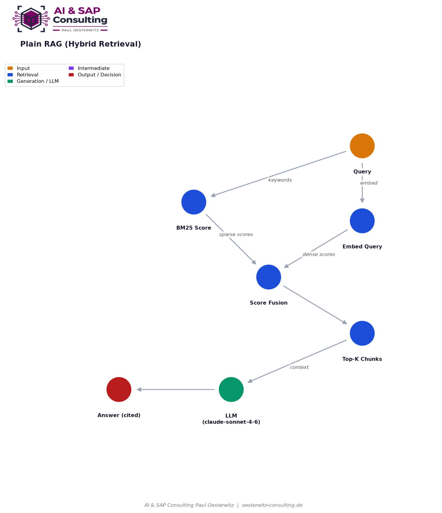

---

### 2. RAG + Reranker (`rerank`)

Retrieves a **wider candidate pool** (default 20 chunks) using the same hybrid
search as Plain RAG, then **re-orders it with a cross-encoder** before passing
the top-k to the LLM.

Reranker cascade (auto-selects the first that loads):

1. **Jina Reranker v2** (`jinaai/jina-reranker-v2-base-multilingual`) — the
   primary. Multilingual cross-encoder; runs locally from HuggingFace.
2. **BGE Reranker v2** (`BAAI/bge-reranker-v2-m3`) — fallback if Jina fails to
   load.
3. **LLM pointwise reranker** — final fallback: asks the configured LLM to score
   each passage 0–10 for relevance.

Cross-encoders are slower than bi-encoders but more accurate because they see
the query *and* the passage together in a single forward pass.

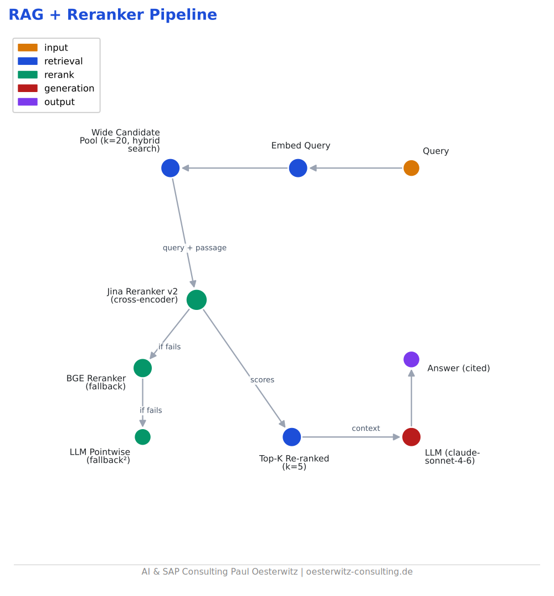

---

### 3. HyDE — Hypothetical Document Embeddings (`hyde`)

Instead of embedding the raw query (which may be short and underspecified),
HyDE asks the LLM to **draft a plausible answer passage** first, then embeds
*that* passage and retrieves on its vector.

Pipeline:

1. LLM generates a 4–6 sentence hypothetical answer (instructed to sound like
   a document excerpt, not a hedged response).
2. The hypothetical passage is embedded as a *document* vector — placing it in
   the same semantic neighbourhood as real passages that answer the question.
3. Hybrid search runs on the hypothetical vector (dense) + the original query
   (BM25), combining the benefits of both.

Works best when the gap between query-space and answer-space is large (e.g.
short factual questions vs. long technical passages).

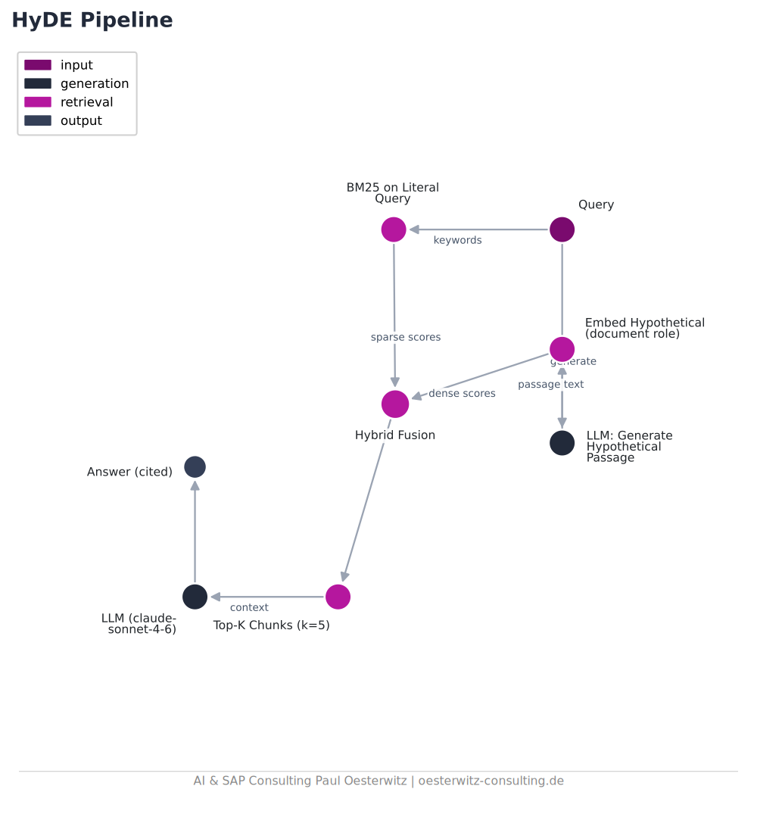

---

### 4. Corrective RAG — CRAG (`corrective`)

Retrieves first, then **grades** each retrieved document for relevance. If
the retrieved set is weak, it takes a *corrective action* before generating.

Pipeline:

1. **Initial retrieval** — hybrid search over a wide candidate pool.
2. **Grading** — the LLM scores the top-8 candidates 0–1 for relevance to the
   query (structured JSON output). Each score and reason is logged in the trace.
3. **Decision** — if fewer than `min_good=3` chunks pass the
   `relevance_threshold=0.5`, CRAG triggers correction:
   - LLM **rewrites** the query into 3 more specific sub-queries (decomposing
     compound questions).
   - Each sub-query is retrieved independently and the new candidates are graded.
4. **Knowledge filtering** — only chunks that pass the relevance threshold are
   passed to the LLM. If still nothing passes, the best-effort set is used.

CRAG is valuable when initial retrieval habitually surfaces related but
off-topic chunks (e.g. partial keyword matches).

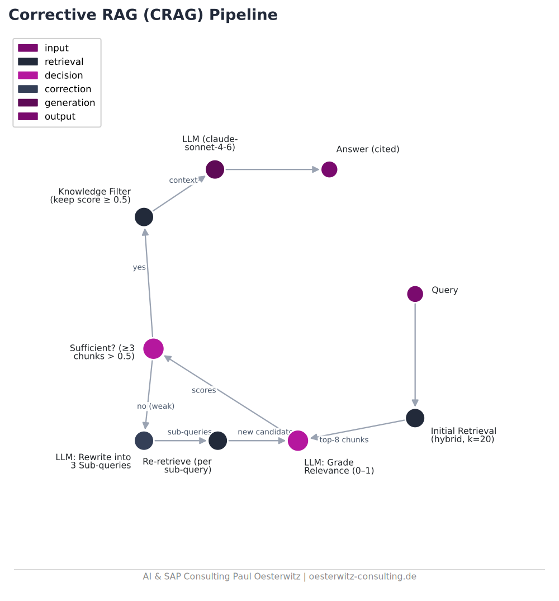

---

### 5. Agentic RAG (`agentic`)

An LLM **agent** that plans its own retrieval, reflects on what it gathered,
and decides whether to issue follow-up searches — up to `max_iters=3` rounds.

Pipeline:

1. **Plan** — the agent decomposes the question into 2–3 focused sub-queries
   (structured JSON output).
2. **Retrieve** — each sub-query is run through hybrid search; results are
   merged and de-duplicated (keeping the highest score per chunk).
3. **Reflect** — the agent reads the gathered evidence and decides:
   - `sufficient: true` → proceed to answer generation.
   - `sufficient: false` + up to 2 follow-up queries → loop back to step 2.
4. The final merged chunk set (scored by relevance) is ranked and the top-k
   passed to the LLM for answering.

Agentic RAG handles multi-hop questions where a single retrieval pass misses
the full picture. The transparency trace shows each iteration's sub-queries and
the agent's sufficiency verdict.

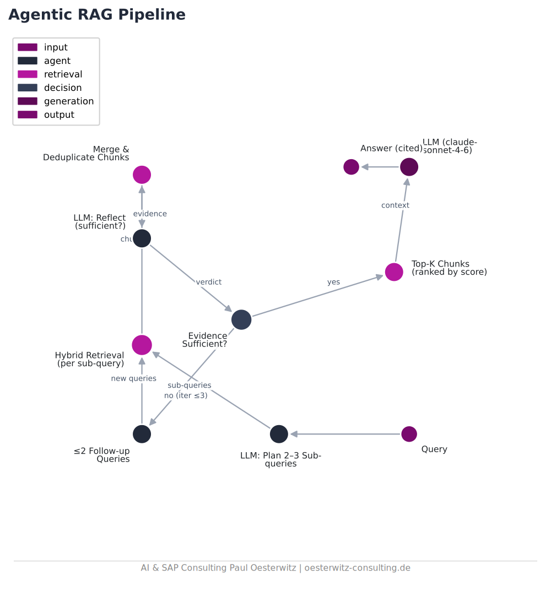

---

### 6. GraphRAG (`graph`)

Builds a **knowledge graph** of entities and relationships offline (at index
time), detects Louvain communities, summarises each community with the LLM, and
at query time uses entity anchoring to retrieve structurally related chunks.

**Offline build** (`python -m rag_lab.cli graph`):

1. Samples up to `graph_max_chunks=240` chunks round-robin across documents.
2. For each chunk, the LLM extracts **entities** (name + type) and
   **relationships** (source → target + description) as structured JSON.
3. An undirected `networkx` graph is built; Louvain community detection
   partitions it into thematic clusters.
4. Each community is summarised with a short LLM-generated paragraph and the
   summary is stored alongside the graph.

**Query-time retrieval**:

1. LLM extracts key entities/concepts from the query (1 LLM call).
2. Entity nodes are matched in the graph (exact + fuzzy token overlap), then
   **expanded to 1-hop neighbours**.
3. Chunks are scored as `0.6 × dense_similarity + 0.4 × entity_overlap_ratio`.
4. Community summaries of matched entities are surfaced in the trace for
   transparency.
5. **Hybrid backfill** — if the graph is sparse, standard hybrid retrieval tops
   up the result set.

GraphRAG benefits domains with rich entity relationships (e.g. medical
knowledge, interconnected technical concepts) where co-citation matters more
than passage-level similarity.

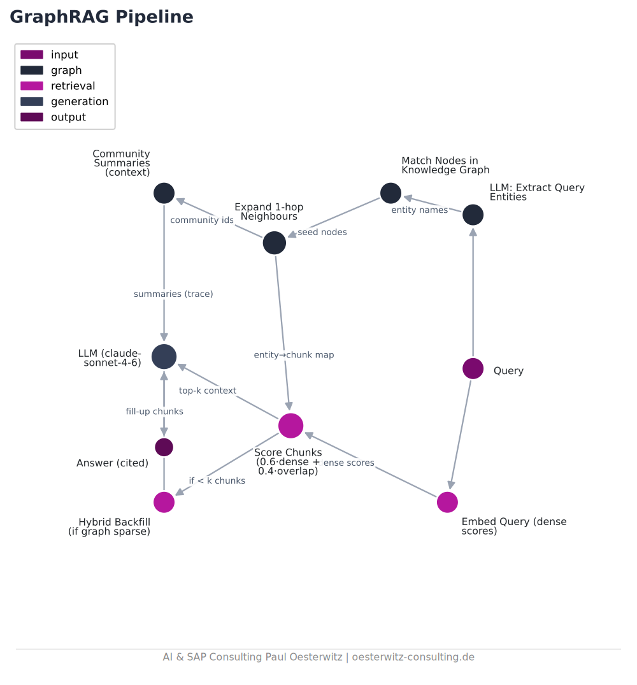

---

## Corpus Documents

> **Demo purpose only.** The PDFs below were chosen to give the lab a diverse
> mix of topics (ML theory, agentic AI, business applications, safety). Feel
> free to drop your own PDFs into the `Documents/` folder and re-embed — the
> pipeline is document-agnostic.

| # | Title | Authors | Source |
|---|-------|---------|--------|
| 1 | [Types of Machine Learning Algorithms](https://www.intechopen.com/chapters/10694) | Taiwo Oladipupo Ayodele | Chapter in *New Advances in Machine Learning*, InTech, 2010 |
| 2 | [Agentic AI For Network Management: Autonomous Troubleshooting And Configuration Through MCP Servers](https://jicrcr.com/) | Vivek Koodakkara Shanmughan | *Journal of International Crisis and Risk Communication Research*, Vol. 9 No. 1, 2026 |
| 3 | [Agents of Chaos](https://arxiv.org/abs/2602.20021) | Natalie Shapira, Chris Wendler, Avery Yen et al. | arXiv:2602.20021, February 2026 |
| 4 | [Artificial Intelligence Adoption: AI-readiness at Firm-Level](https://aisel.aisnet.org/pacis2018/230/) | PACIS 2018 authors | *PACIS 2018 Proceedings*, Association for Information Systems |
| 5 | [Expanding AI's Impact With Organizational Learning](https://sloanreview.mit.edu/projects/expanding-ais-impact-with-organizational-learning/) | Sam Ransbotham, Shervin Khodabandeh et al. | MIT Sloan Management Review + BCG, October 2020 |
| 6 | Towards Enhanced Safety Stock Estimation: Exploring Machine Learning Strategies for Supply Chain Demand Forecasting | João Nuno Costa Gonçalves | PhD Thesis, Universidade do Minho, December 2020 |
| 7 | [Using AI to Enhance Business Operations](https://sloanreview.mit.edu/article/using-ai-to-enhance-business-operations/) | Monideepa Tarafdar, Cynthia M. Beath, Jeanne W. Ross | *MIT Sloan Management Review*, Summer 2019 |
| 8 | [HyperAgents](https://arxiv.org/abs/2603.19461) | Jenny Zhang, Bingchen Zhao, Wannan Yang, Jakob Foerster, Jeff Clune, Minqi Jiang, Sam Devlin, Tatiana Shavrina | arXiv:2603.19461, March 2026 |
| 9 | Deep Learning with Python | François Chollet | Manning Publications, 2nd edition 2021 |
| 10 | Agentic Design Patterns: A Hands-On Guide to Building Intelligent Systems | Antonio Gulli | Book, 2025 |
| 11 | [Software Engineering for Machine Learning: A Case Study](https://doi.org/10.1109/ICSE-SEIP.2019.00042) | Saleema Amershi et al. (Microsoft Research) | *ICSE-SEIP 2019*, IEEE |

---

## Evaluation Pipeline

Goldens are synthesized from gold chunks (pairs of adjacent same-document
chunks) by DeepEval's `Synthesizer`, then used to evaluate every approach.

### Metrics (DeepEval)

| Metric | What it measures |
|--------|-----------------|
| **Answer Relevancy** | How directly the generated answer addresses the question |
| **Faithfulness** | Whether every claim in the answer is supported by the retrieved context |
| **Contextual Relevancy** | How relevant the retrieved chunks are to the question |
| **Contextual Precision** | What fraction of retrieved chunks are actually useful |
| **Contextual Recall** | How much of the gold answer is covered by retrieved chunks |
| **Correctness (G-Eval)** | Factual correctness vs. the reference answer (custom criteria) |
| **Composite** | Mean of the six metrics above |

### How Each Metric Works

One knowledge-graph diagram per metric, generated with the plot MCP server and
verified by automated visual QA (Qwen3 vision model).

| Metric | Inputs | Diagram |
|--------|--------|---------|
| Answer Relevancy | `input`, `actual_output` | 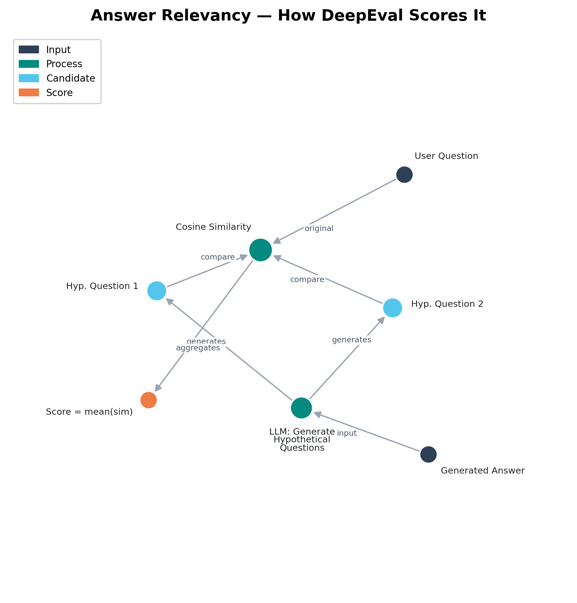 |
| Faithfulness | `actual_output`, `retrieval_context` | 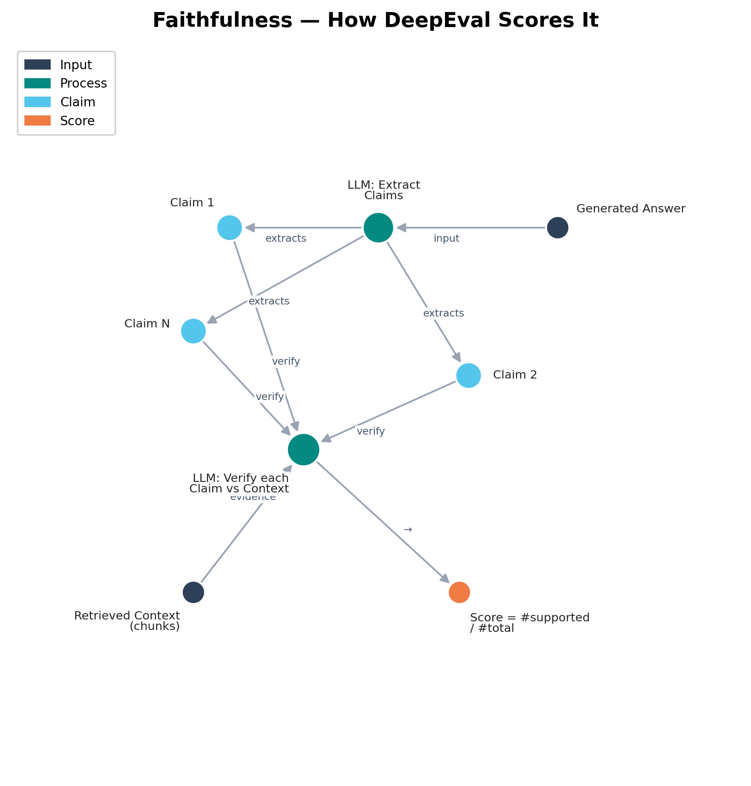 |
| Contextual Relevancy | `input`, `retrieval_context` | 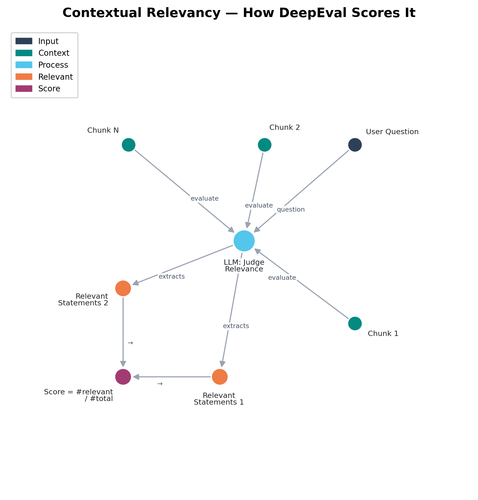 |
| Contextual Precision | `input`, `expected_output`, `retrieval_context` | 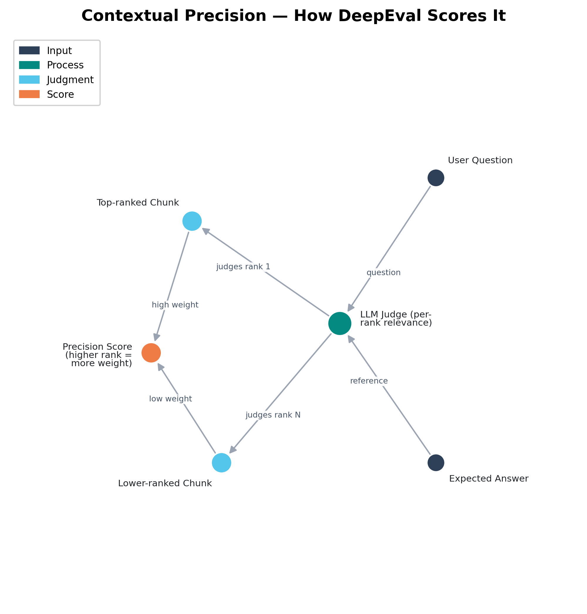 |
| Contextual Recall | `expected_output`, `retrieval_context` | 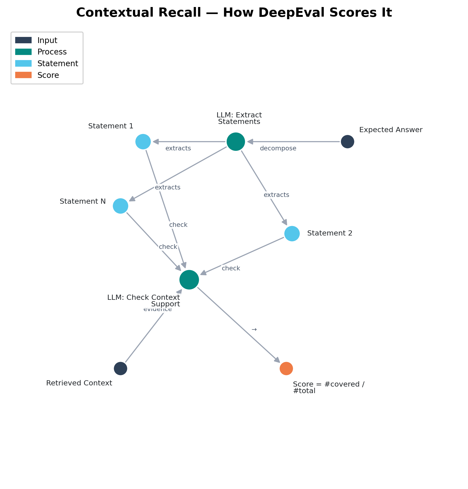 |
| Correctness (G-Eval) | `actual_output`, `expected_output` | 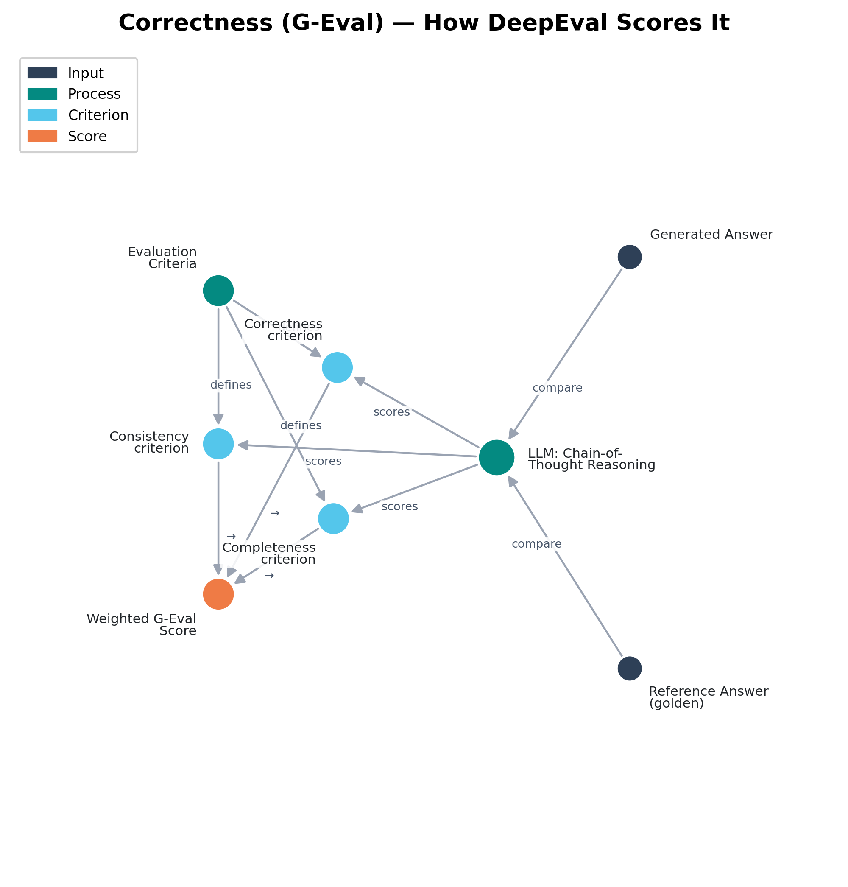 |

### Retrieval-level metrics (custom, on top of DeepEval)

| Metric | What it measures |
|--------|-----------------|
| **Gold-chunk hit rate** | Fraction of goldens where ≥1 gold chunk appears in the top-k |
| **Gold-doc hit rate** | Fraction where the gold document appears (looser) |
| **Avg latency (s)** | End-to-end wall-clock per question (retrieval + generation) |
| **Avg context chars** | Total characters passed to the LLM per question |
| **Avg # contexts** | Mean chunks per answer |

Results are written incrementally to `data/eval/results.json` (per approach) so
the dashboard updates live as each approach finishes.

---

## Web App

Four tabs, served by FastAPI at `http://localhost:8000`:

### Index & Eval
Orchestrate the full pipeline from the UI:
- **Re-embed** — chunk all PDFs and build the base dense + BM25 index (live
  progress bar per document).
- **Build graph** — run the offline GraphRAG extraction and community
  summarisation.
- **Synthesize goldens** — generate evaluation Q&A pairs from gold chunks.
- **Run DeepEval** — evaluate all approaches; results stream in per approach
  as they finish.

### Chat / Explore
Pick one of the six approaches, ask a question, and inspect:
- The **generated answer** with inline source citations (`[1]`, `[2]`, …).
- **Retrieved chunks** quoted verbatim with citation, document name, pages, and
  retrieval score.
- The full **retrieval trace** (sub-queries, grading decisions, graph anchors,
  community summaries, etc.) rendered as a collapsible step list.

### DeepEval Dashboard
- **Radar chart** — all six metrics overlaid per approach for at-a-glance
  comparison.
- **Bar charts** — per-metric breakdown.
- **Summary table** — composite and per-metric scores; best per column
  highlighted.
- **Retrieval-level metrics** — latency, hit rates, context size.
- **Per-question drill-down** — click any golden to see every metric score and
  the model's reasoning per approach.

### Goldens
Browse the synthesized evaluation set: question, expected answer, source
document, and the gold chunks the question was generated from.

---

## Stack

| Layer | Technology |
|-------|-----------|
| Embeddings | `intfloat/multilingual-e5-small` (384-d, sentence-transformers) *or* Ollama `embeddinggemma:latest` (768-d) |
| Generation | Anthropic `claude-sonnet-4-6` *or* any Ollama model |
| Judging / synthesis | Anthropic `claude-haiku-4-5-20251001` *or* any Ollama model |
| Reranker | `jinaai/jina-reranker-v2-base-multilingual` → `BAAI/bge-reranker-v2-m3` → LLM pointwise |
| Vector store | In-process NumPy cosine + `rank-bm25` hybrid (no external DB) |
| Graph | `networkx` (Louvain community detection) |
| Evaluation | `deepeval` with custom `ClaudeJudge` / `OllamaJudge` |
| Backend | FastAPI + Uvicorn |
| Frontend | Vue 3 + Vite + Chart.js |

---

## Setup

```bash
# Python environment (already exists in this checkout)
python3 -m venv .venv
.venv/bin/pip install -r requirements.txt

# Frontend
cd web && npm install && npm run build && cd ..

# API key (Claude provider — default)
cp .env.example .env
# edit .env:  ANTHROPIC_API_KEY=sk-ant-...
```

---

## Run

```bash
# Start the server (serves built Vue app + API)
.venv/bin/python -m uvicorn rag_lab.api.server:app --host 0.0.0.0 --port 8000

# Optional: hot-reload frontend dev server on :5173, proxying /api → :8000
cd web && npm run dev
```

Open **http://localhost:8000**.

### CLI

```bash
.venv/bin/python -m rag_lab.cli embed          # (re)embed Documents → base index
.venv/bin/python -m rag_lab.cli graph          # build the GraphRAG graph
.venv/bin/python -m rag_lab.cli synth -n 100   # synthesize 100 goldens
.venv/bin/python -m rag_lab.cli eval           # DeepEval across all approaches
.venv/bin/python -m rag_lab.cli all -n 100     # embed + graph + synth + eval
.venv/bin/python -m rag_lab.cli status         # show index / graph / golden counts
```

---

## Configuration

All settings live in `rag_lab/config.py` and are overridable via environment
variables (or `.env`):

```bash
# Provider
RAG_PROVIDER=claude                          # "claude" (default) | "ollama"

# Models — Claude
RAG_GEN_MODEL=claude-sonnet-4-6             # RAG answer generation
RAG_JUDGE_MODEL=claude-haiku-4-5-20251001   # DeepEval judging + synthesis
RAG_EMBED_MODEL=intfloat/multilingual-e5-small
RAG_EMBED_DIM=384

# Models — Ollama (set RAG_PROVIDER=ollama first)
RAG_GEN_MODEL=qwen3.6:35b-a3b-q8_0
RAG_JUDGE_MODEL=qwen3.6:35b-a3b-q8_0
RAG_EMBED_MODEL=embeddinggemma:latest
RAG_EMBED_DIM=768
OLLAMA_HOST=http://localhost:11434

# Chunking (dynamic — splits on paragraph/heading boundaries)
# RAG_MIN_CHUNK_CHARS=120   # skip fragments shorter than this

# Retrieval
RAG_TOP_K=5                 # chunks fed to LLM
RAG_CANDIDATE_K=20          # pre-rerank pool size
RAG_BM25_WEIGHT=0.35        # hybrid fusion weight

# Evaluation
RAG_EVAL_NUM_GOLDENS=100    # goldens to synthesize
```

> **Note on rate limits (Claude provider):** this org has a ~5 RPM limit across
> all Claude models. The client applies a 4 RPM token-bucket limiter per model
> automatically. A full eval run with 100 goldens takes roughly 15–20 hours.
> Increase `RAG_GEN_CONCURRENCY=1` (already the safe default) to avoid
> exhausting retries.
